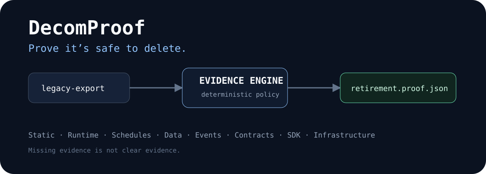
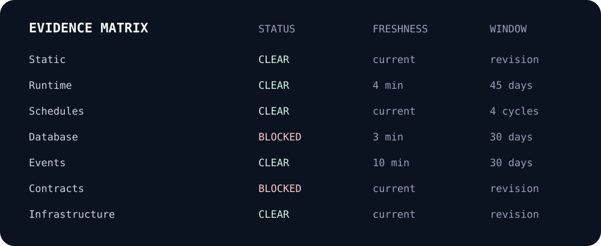
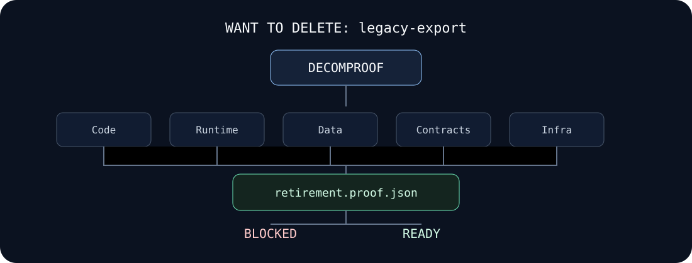

<p align="center">
  
</p>

# DecomProof

**Prove it’s safe to delete.**

Finding a reference is easy. Proving there are no important dependencies left is hard. DecomProof gathers the evidence you need before deleting software.

[](https://github.com/PSR94/DecomProof/actions/workflows/ci.yml)
[](LICENSE)
[](docs/project-status.md)

Static analysis tells you what references something. Telemetry tells you what used it recently. DecomProof combines code, runtime, contracts, data, schedules, events, infrastructure and consumer evidence to decide whether the available evidence supports removal.

## Immediate example

```bash
decomproof init
decomproof analyze service:legacy-export --root . --evidence ./runtime.jsonl
```

A blocked target is explicit:

```text
DecomProof

Target: service:legacy-export
Removal Readiness: 41 / 100
Verdict: Blocked

Blockers: 4
Uncertainties: 1
```

The machine-readable artifact is `retirement.proof.json` and validates against [`schemas/retirement-proof-v1.schema.json`](schemas/retirement-proof-v1.schema.json).

## Why grep is not enough

A static reference scan cannot tell you about a customer calling an endpoint once per quarter. Zero traffic over two hours cannot rule out a monthly batch. A clean application graph cannot tell you that a table is still receiving writes. A deprecated OpenAPI endpoint may still be present in the current SDK. DecomProof treats every one of these as a separate evidence claim with provenance, freshness, window and confidence.

<p align="center"></p>

## The proof, not a guess

A proof records target identity/fingerprint, source revision and policy version, normalized evidence with stable IDs/raw hashes, observation windows/gaps/freshness, consumer identity quality, evidence-linked dependency edges, hard blockers, explicit uncertainty, deterministic score and verdict rationale.

DecomProof does not mathematically prove nonexistence. It establishes whether collected evidence satisfies a configured retirement policy. See [Proof of absence](docs/concepts/proof-of-absence.md).

## Quick start

Requirements: a current stable Rust toolchain for the core/CLI. Optional API/dashboard dependencies are documented separately.

```bash
git clone https://github.com/PSR94/DecomProof.git
cd DecomProof
make setup
make test
make demo
```

```bash
make demo-stage-0   # expected safety refusal: hidden dependencies exist
make demo-ready     # blockers removed and observation window sufficient
make demo-verify    # intentionally finds a post-removal leftover
```

## Target identifiers

```text
service:legacy-export
api:POST:/v1/export
feature:legacy-checkout
flag:old-dashboard
env:ENABLE_OLD_FLOW
job:nightly-export
db-table:legacy_sessions
db-column:users.legacy_id
event:order.created.v1
topic:order-events-v1
package-export:LegacyClient
terraform:aws_lambda_function.legacy_export
k8s:deployment:legacy-export
```

## Evidence sources

| Family | v0.1 path | Notes |
|---|---|---|
| Static code/config | workspace scanner | JS/TS/Python heuristic; SQL/YAML/OpenAPI/Terraform/K8s/GitHub Actions context classification |
| Runtime HTTP | access-log / generic JSONL | offline-first; consumer IDs hashed |
| OpenTelemetry | OTLP JSON spans | `service.name` consumer mapping when present |
| Prometheus | exposition text | snapshot usage evidence; no invented historical window |
| Schedules | static CronJob/workflow + imported cycle evidence | active refs block; absence can require observed cycles |
| Databases | SQL scan + PostgreSQL evidence exporter | live exporter is explicit read-only and experimental |
| Events | imported Kafka/event metadata | active consumer evidence can hard-block |
| Contracts | OpenAPI scan | public exposure is blocking in v0.1 |
| SDK/package | Python/JS export/reference scan | public export is a high blocker |
| Infrastructure | Terraform/Kubernetes/Docker Compose scan | read-only; never deletes resources |
| Verification | post-removal evidence imports | failures/leftovers prevent verified status |

See [project status](docs/project-status.md) for exact support boundaries.

## Observation windows

A zero count without time is weak evidence. Dynamic evidence records start/end, known gaps and freshness. Policy checks compare available windows with configured minimums and mark stale evidence as uncertainty rather than silently treating it as clear.

## Dependency graph

<p align="center"></p>

Every graph edge stores the evidence ID that caused it. The graph is an explanation layer over evidence, not an invented architecture model.

## AtlasCommerce demo

AtlasCommerce models a mature SaaS retirement. The initial `legacy-export` target remains reachable through a finance CronJob, a public OpenAPI path, an old SDK export, database writes, an event consumer and deployment resources. Runtime evidence also contains an identified external consumer. Staged fixtures remove those dependencies through actual source/evidence changes; scores are not hardcoded.

See [`examples/atlascommerce`](examples/atlascommerce) and [`docs/demo-script.md`](docs/demo-script.md). `apps/atlascommerce` provides an optional live service whose deprecated endpoint writes both access-log and database evidence.

## GitHub removal gate

```yaml
- uses: PSR94/DecomProof/packages/github-action@main
  with:
    target: service:legacy-export
    root: .
    evidence: .decomproof/runtime.jsonl
```

The action writes a Step Summary and returns the safety-gate exit code. Upload the generated proof with `actions/upload-artifact`.

## Reports

```bash
decomproof proof retirement.proof.json --format markdown --output retirement.md
decomproof proof retirement.proof.json --format html --output retirement.html
decomproof evidence retirement.proof.json --signal runtime.http.requests
decomproof diff previous.proof.json retirement.proof.json
```

## Post-removal verification

```bash
decomproof verify service:legacy-export --evidence verification.jsonl
```

Verification is separate from pre-removal readiness. With no verification evidence, DecomProof fails conservatively instead of declaring success.

## Architecture

The Rust core owns target identity, evidence normalization, temporal logic, graph construction, policy evaluation, scoring and proof generation. Network-facing systems are optional shells around that deterministic core.

- [Architecture diagrams](docs/architecture/diagrams.md)
- [ADRs](docs/architecture/decisions/)
- [Retirement proof reference](docs/reference/retirement-proof.md)
- [Scoring](docs/concepts/scoring.md)
- [Lifecycle](docs/concepts/lifecycle.md)

## Security, privacy and limitations

Analysis is read-only by default. DecomProof does not automatically delete infrastructure or database objects. Consumer identifiers are hashed by the core importers where applicable. Dynamic reflection, unsupported languages, sampled/missing telemetry, rare workloads, external direct database clients and manual dependencies can remain invisible; such coverage gaps must not be equated with safety. See [`SECURITY.md`](SECURITY.md) and [limitations](docs/concepts/limitations.md).

## Roadmap and contributing

The goal for 0.1 is a trustworthy offline-first research/developer tool before broad SaaS integrations. See [`ROADMAP.md`](ROADMAP.md) and [`CONTRIBUTING.md`](CONTRIBUTING.md).

Apache-2.0 licensed. No AI model participates in the readiness verdict.
