# Architecture diagrams

## 1. Overall architecture
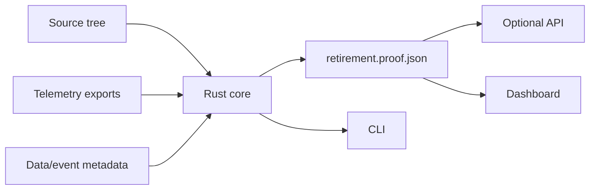

## 2. Evidence ingestion
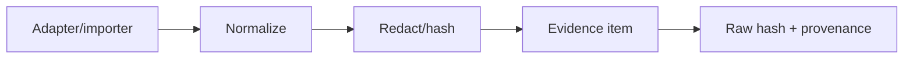

## 3. Analysis pipeline
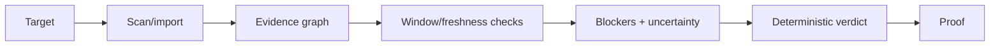

## 4. Target lifecycle
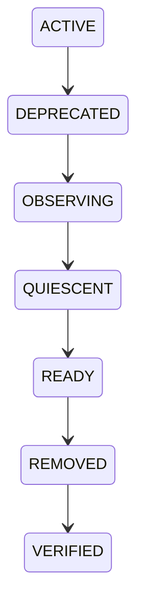

## 5. Proof generation
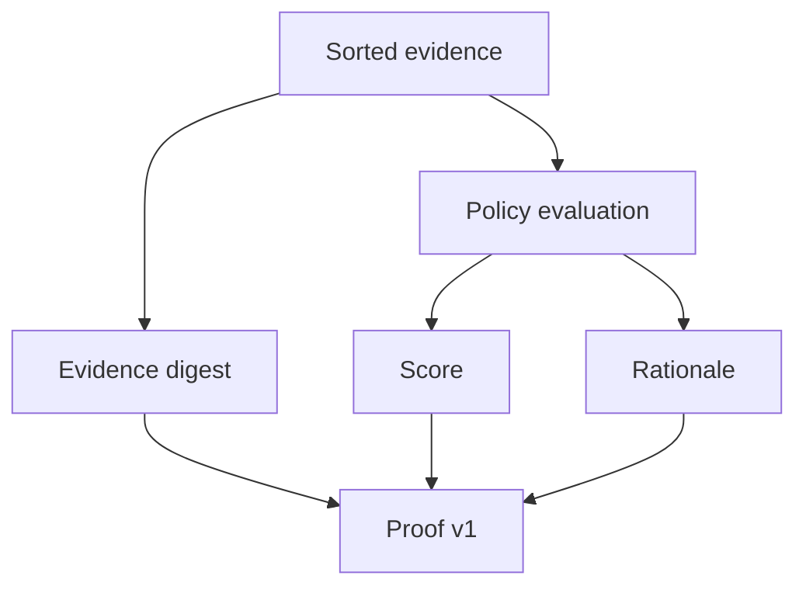

## 6. Static dependency graph
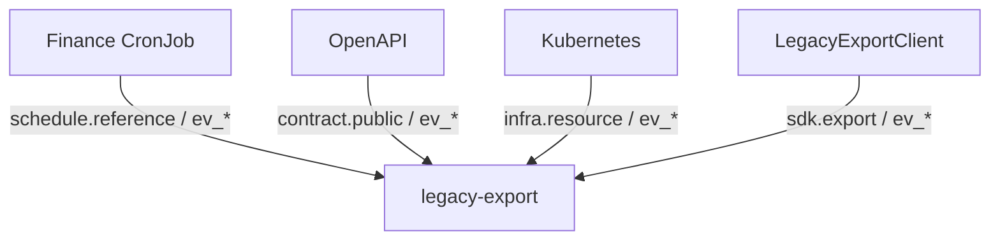

## 7. Runtime consumer mapping
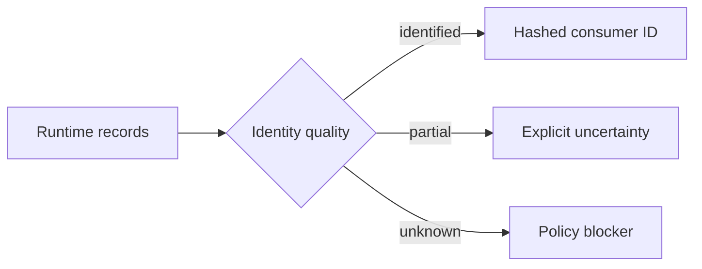

## 8. Temporal evidence flow
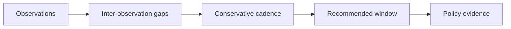

## 9. Policy evaluation
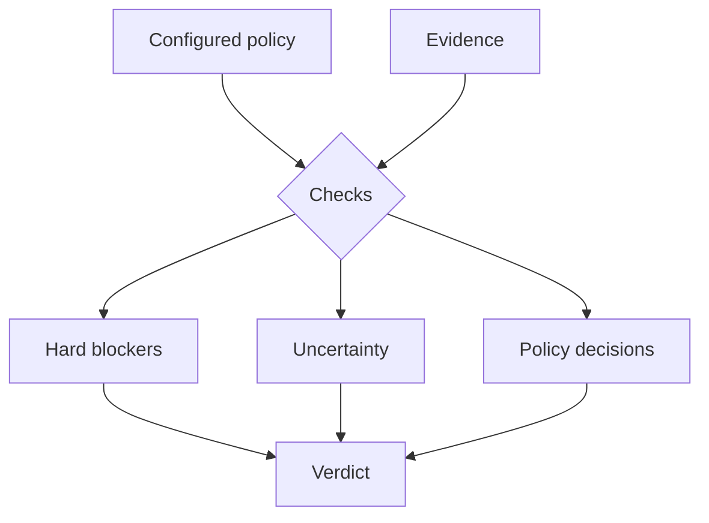

## 10. GitHub PR gate
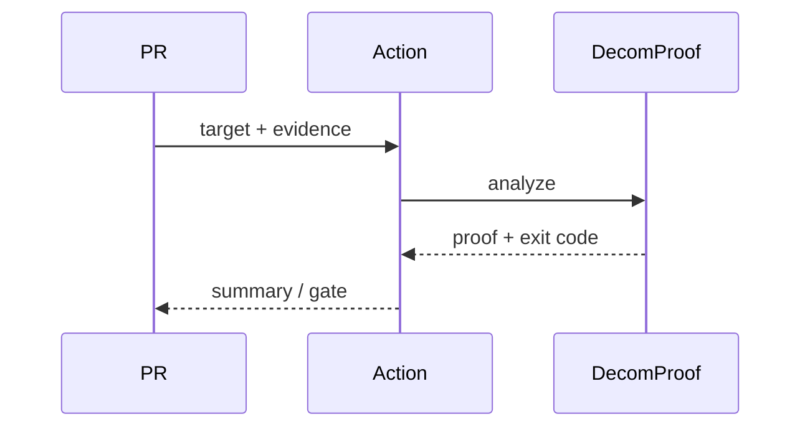

## 11. Post-removal verification
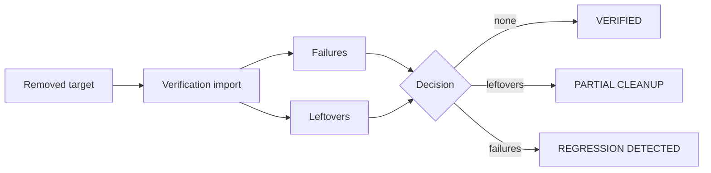

## 12. Database ER model
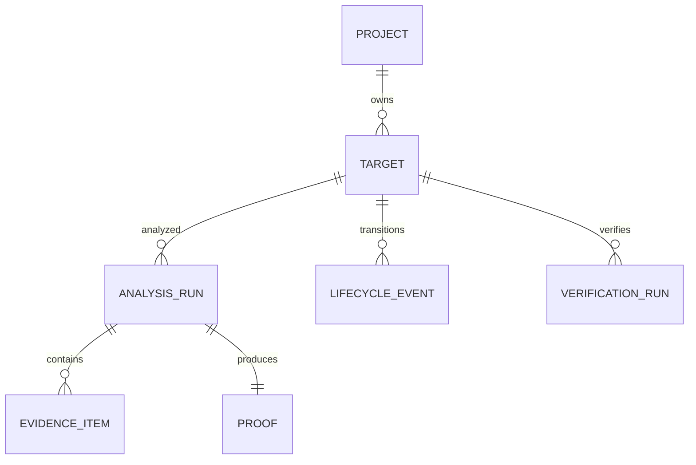

## 13. Deployment architecture
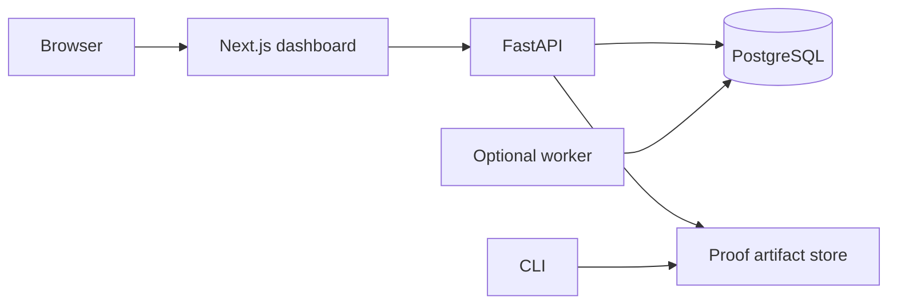

## 14. AtlasCommerce demo architecture
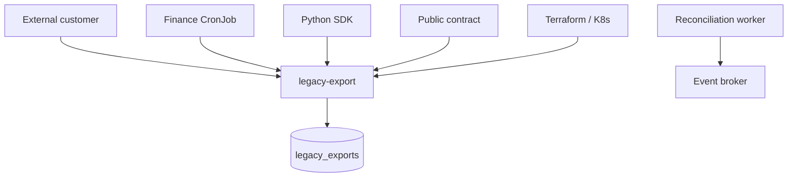

## 15. Security trust boundaries
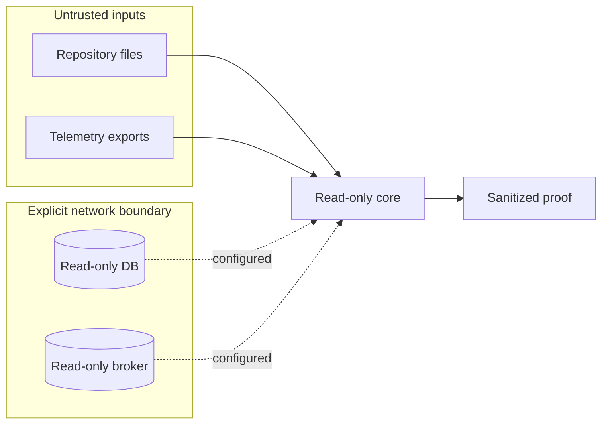
